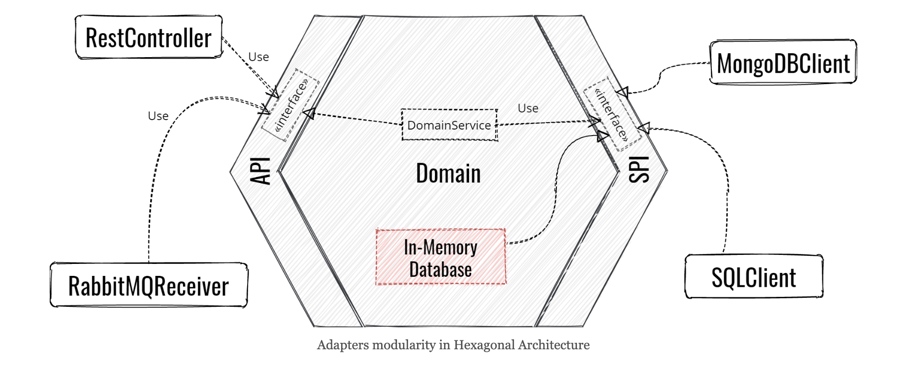

# RPN Calculator

## How to install?

* `make configure`: this will prepare your environment using venv, python3 and flit.

For development : `make install-dev` as it will enable editable installation.   
For production  : `make install`

## How to run?

start in interactive mode: `make run`
swagger is on http://localhost:8000/docs

## What happens when I commit code?

There are 4 checks that are done each time you will commit:
- flake8: Lints the code to catch coding errors, enforce a coding standard, and limit code complexity. Here, it's configured to restrict complexity scores.  
- black: Formats your Python code without changing its semantics, ensuring consistent code style. It checks and outputs diffs for changes.  
- isort: Sorts your imports alphabetically, and automatically separated into sections. It checks and displays diffs without applying changes directly.  
- bandit: Analyzes code to find common security issues. It's configured to recursively check all Python files in the src directory against a configuration.  

you may use `make format` and `make lint` to do some automatic magic.  

## How to test?

For running all tests:

`make test`

For running only unit tests:

`make test-unit`

For running only e2e tests:

`make test-e2e`

For running tests with coverage:

`make test-cov`

## Architecture 
For dependency inversion and testability, this project uses Hexagonal architecture

find more [here](https://beyondxscratch.com/2017/08/19/hexagonal-architecture-the-practical-guide-for-a-clean-architecture/amp/)

It also implements basic principles of CQRS architecture
find more [here](https://cqrs.wordpress.com/wp-content/uploads/2010/11/cqrs_documents.pdf)

## Some patterns used
From design patterns:
- Command pattern to implement the calculator commands
- Composite pattern for calculation

from microservices patterns
- Repository pattern
- Command bus pattern

from tactical DDD:
- Aggregate pattern: RpnStack
- Value Object pattern: Calculation

## Methodology
- Use case driven (not data modelisation first)
- TDD used to design the core step by step
- DDD used for the model
- Pyramid of tests with outside in approach (Chicago school): unit, integration(todo) and e2e

You may find more information about VisionPM's (my company) approach and craft culture,
check out this software craftsmanship KATA I've created few years
ago [here](https://houcemnaffati.github.io/A-Software-Craftsmanship-KATA/):
